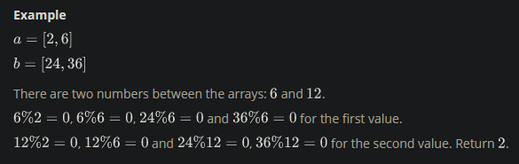
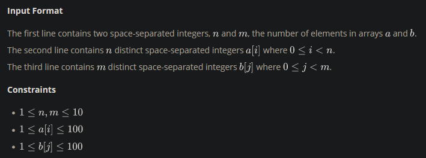

There will be two arrays of integers. Determine all integers that satisfy the following two conditions:

- The elements of the first array are all factors of the integer being considered
- The integer being considered is a factor of all elements of the second array

These numbers are referred to as being between the two arrays. Determine how many such numbers exist.

<h3>Function Description</h3>

Complete the getTotalX function in the editor below. It should return the number of integers that are betwen the sets.

getTotalX has the following parameter(s):

- int a[n]: an array of integers
- int b[m]: an array of integers

<h3>Returns</h3>

- int: the number of integers that are between the sets

<h3>Sample Input</h3>

    2 3
    2 4
    16 32 96

<h3>Sample Output</h3>

    3

<h3>Explanation</h3>

2 and 4 divide evenly into 4, 8, 12 and 16.
4, 8 and 16 divide evenly into 16, 32, 96.

4, 8 and 16 are the only three numbers for which each element of a is a factor and each is a factor of all elements of b. 