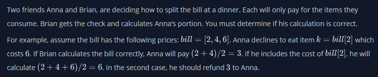
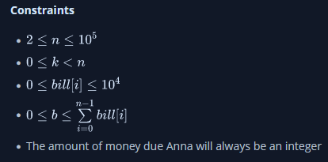
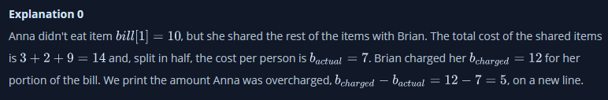
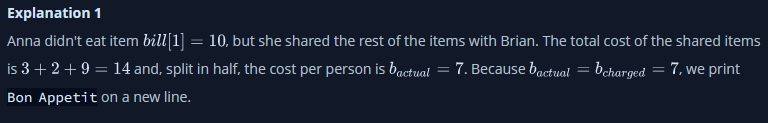

# Bill Division

### Function Description

Complete the bonAppetit function in the editor below. It should print Bon Appetit if the bill is fairly split. Otherwise, it should print the integer amount of money that Brian owes Anna.

bonAppetit has the following parameter(s):

- bill: an array of integers representing the cost of each item ordered
- k: an integer representing the zero-based index of the item Anna doesn't eat
- b: the amount of money that Anna contributed to the bill

### Input Format

The first line contains two space-separated integers n and k, the number of items ordered and the 0-based index of the item that Anna did not eat.
The second line contains n space-separated integers bill[i] where 0 <= i < n.
The third line contains an integer, b, the amount of money that Brian charged Anna for her share of the bill.

### Output Format

If Brian did not overcharge Anna, print Bon Appetit on a new line; otherwise, print the difference (i.e.,) that Brian must refund to Anna. This will always be an integer.

### Sample Input 0

    4 1
    3 10 2 9
    12

### Sample Output 0

    5

### Sample Input 1

    4 1
    3 10 2 9
    7

### Sample Output 1

    Bon Appetit

