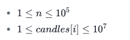

## Birthday Cake Candles

You are in charge of the cake for a child's birthday. You have decided the cake will have one candle for each year of their total age. They will only be able to blow out the tallest of the candles. Count how many candles are tallest.

### Example

**_candles_** = **[4,4,1,3]**

The maximum height candles are  units high **4**. There are **2** of them, so return **2**.

### Function Description

Complete the function birthdayCakeCandles in the editor below.

birthdayCakeCandles has the following parameter(s):

int candles[n]: the candle heights
Returns

int: the number of candles that are tallest
Input Format

The first line contains a single integer, **_n_**, the size of _**candles[]**_.

The second line contains  space-separated integers, where each integer  describes the height of _**candles[i]**_.

### Constraints



### Sample Input 0
```
4
3 2 1 3
```

### Sample Output 0
```
2
Explanation 0
```

Candle heights are **[3, 2, 1, 3]**. The tallest candles are **3** units, and there are **2** of them.