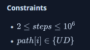

# Counting Valleys

An avid hiker keeps meticulous records of their hikes. During the last hike that took exactly **steps** steps, for every step it was noted if it was an uphill , **U**, or a downhill **D**, step. Hikes always start and end at sea level, and each step up or down represents a **1** unit change in altitude. We define the following terms:

- A mountain is a sequence of consecutive steps above sea level, starting with a step up from sea level and ending with a step down to sea level.

- A valley is a sequence of consecutive steps below sea level, starting with a step down from sea level and ending with a step up to sea level.

Given the sequence of up and down steps during a hike, find and print the number of valleys walked through.

### Example

    steps = 8 path = [DDUUUUDD]

The hiker first enters a valley **2** units deep. Then they climb out and up onto a mountain **2** units high. Finally, the hiker returns to sea level and ends the hike.

### Function Description

Complete the countingValleys function in the editor below.

countingValleys has the following parameter(s):

- int steps: the number of steps on the hike
- string path: a string describing the path

### Returns

    int: the number of valleys traversed

### Input Format

The first line contains an integer **steps**, the number of steps in the hike.
The second line contains a single string **path**, of **steps** characters that describe the path.

### Sample Input

    8
    UDDDUDUU

### Sample Output

    1

### Explanation

If we represent \_ as sea level, a step up as /, and a step down as \, the hike can be drawn as:

    _/\      _
       \    /
        \/\/

The hiker enters and leaves one valley.
