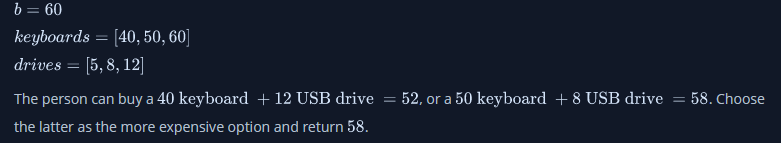
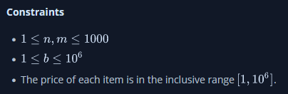

A person wants to determine the most expensive computer keyboard and USB drive that can be purchased with a give budget. Given price lists for keyboards and USB drives and a budget, find the cost to buy them. If it is not possible to buy both items, return **-1**.

<h3>Example</h3>

<h3>Function Description</h3>

Complete the getMoneySpent function in the editor below.

getMoneySpent has the following parameter(s):

- int keyboards[n]: the keyboard prices
- int drives[m]: the drive prices
- int b: the budget

<h3>Returns</h3>

- int: the maximum that can be spent, or **-1** if it is not possible to buy both items

<h3>Input Format</h3>

The first line contains three space-separated integers **b**, **n**, and **m**, the budget, the number of keyboard models and the number of USB drive models.

The second line contains **n** space-separated integers **keyboards[i]**, the prices of each keyboard model.

The third line contains **m** space-separated integers **drives**, the prices of the USB drives.

<h3>Sample Input 0</h3>

    10 2 3
    3 1
    5 2 8

<h3>Sample Output 0</h3>

    9

<h3>Explanation 0</h3>

Buy the 2^nd keyboard and 3^rd the USB drive for a total cost of **8 + 1 = 9**.

<h3>Sample Input 1</h3>

    5 1 1
    4
    5

<h3>Sample Output 1</h3>

    -1

<h3>Explanation 1</h3>

There is no way to buy one keyboard and one USB drive because **4 + 5 > 5**, so return **-1**.
