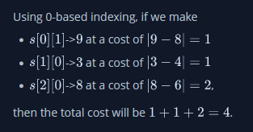

# Forming a Magic Square

We define a magic square to be an **n x n** matrix of distinct positive integers from **1** to **n^2** where the sum of any row, column, or diagonal of length **n** is always equal to the same number: the magic constant.

You will be given a **3 x 3** matrix **s** of integers in the inclusive range **[1, 9]**. We can convert any digit **a** to any other digit **b** in the range **[1, 9]** at cost of **[a - b]**. Given **s**, convert it into a magic square at minimal cost. Print this cost on a new line.

**Note:** The resulting magic square must contain distinct integers in the inclusive range **[1, 9]**.

### Example

    $s = [[5, 3, 4], [1, 5, 8], [6, 4, 2]]

The matrix looks like this:

    5 3 4
    1 5 8
    6 4 2

We can convert it to the following magic square:

    8 3 4
    1 5 9
    6 7 2

This took three replacements at a cost of **[5 - 8] + [8 - 9] + [4 - 7] = 7**.

### Function Description

Complete the formingMagicSquare function in the editor below.

formingMagicSquare has the following parameter(s):

- int s[3][3]: a **3 x 3** array of integers

### Returns

- int: the minimal total cost of converting the input square to a magic square

### Input Format

Each of the **3** lines contains three space-separated integers of row **s[i]**.

### Constraints

### Sample Input 0

    4 9 2
    3 5 7
    8 1 5

### Sample Output 0

    1

### Explanation 0

If we change the bottom right value, **s[2][2]**, from **5** to **6** at a cost of **|6 - 5| = 1**, **s** becomes a magic square at the minimum possible cost.

### Sample Input 1

4 8 2
4 5 7
6 1 6

### Sample Output 1

4

### Explanation 1

