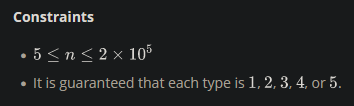

Given an array of bird sightings where every element represents a bird type id, determine the id of the most frequently sighted type. If more than 1 type has been spotted that maximum amount, return the smallest of their ids.

<h3>Example</h3>

arr = [1, 1, 2, 2, 3]

There are two each of types 1 and 2, and one sighting of type 3. Pick the lower of the two types seen twice: type 1.

<h3>Function Description</h3>

Complete the migratoryBirds function in the editor below.

migratoryBirds has the following parameter(s):

- int arr[n]: the types of birds sighted

<h3>Returns</h3>

- int: the lowest type id of the most frequently sighted birds

<h3>Input Format</h3>

The first line contains an integer, n, the size of arr.
The second line describes arr as space-separated integers, each a type number of the bird sighted.

<h3>Sample Input 0</h3>

    6
    1 4 4 4 5 3

<h3>Sample Output 0</h3>

    4

<h3>Explanation 0</h3>

The different types of birds occur in the following frequencies:

- Type 1 : 1 bird
- Type 2 : 0 birds
- Type 3 : 1 bird
- Type 4 : 3 birds
- Type 5 : 1 bird

The type number that occurs at the highest frequency is type 4, so we print 4 as our answer.

<h3>Sample Input 1</h3>

    11
    1 2 3 4 5 4 3 2 1 3 4

<h3>Sample Output 1</h3>

    3

<h3>Explanation 1</h3>

The different types of birds occur in the following frequencies:

- Type 1 : 2
- Type 2 : 2
- Type 3 : 3
- Type 4 : 3
- Type 5 : 1

Two types have a frequency of , and the lower of those is type 3.
