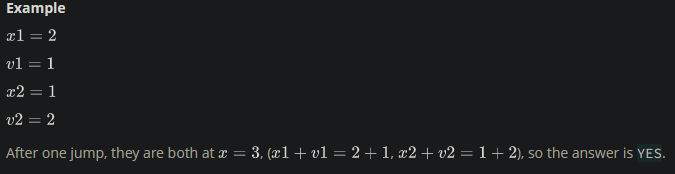
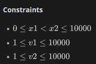

You are choreographing a circus show with various animals. For one act, you are given two kangaroos on a number line ready to jump in the positive direction (i.e, toward positive infinity).

- The first kangaroo starts at location x1 and moves at a rate of v1 meters per jump.
- The second kangaroo starts at location x2 and moves at a rate of v2 meters per jump.

You have to figure out a way to get both kangaroos at the same location at the same time as part of the show. If it is possible, return YES, otherwise return NO.

<h3>Function Description</h3>

Complete the function kangaroo in the editor below.

kangaroo has the following parameter(s):

- int x1, int v1: starting position and jump distance for kangaroo 1
- int x2, int v2: starting position and jump distance for kangaroo 2

<h3>Returns</h3>

- string: either YES or NO

Input Format

A single line of four space-separated integers denoting the respective values of x1, v1, x2, and v2.

<h3>Sample Input 0</h3>

    0 3 4 2

<h3>Sample Output 0</h3>

    YES

<h3>Explanation 0</h3>

The two kangaroos jump through the following sequence of locations:

From the image, it is clear that the kangaroos meet at the same location (number on the number line) after same number of jumps (

jumps), and we print YES.

<h3>Sample Input 1</h3>

    0 2 5 3

<h3>Sample Output 1</h3>

    NO

<h3>Explanation 1</h3>

The second kangaroo has a starting location that is ahead (further to the right) of the first kangaroo's starting location (i.e. x2 > x1). Because the second kangaroo moves at a faster rate (meaning v2 > v1) and is already ahead of the first kangaroo, the first kangaroo will never be able to catch up. Thus, we print NO.
