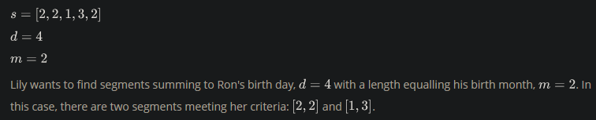
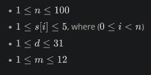

Two children, Lily and Ron, want to share a chocolate bar. Each of the squares has an integer on it.

Lily decides to share a contiguous segment of the bar selected such that:

- The length of the segment matches Ron's birth month, and,
- The sum of the integers on the squares is equal to his birth day.

Determine how many ways she can divide the chocolate.

<h3>Example</h3>

<h3>Function Description</h3>

Complete the birthday function in the editor below.

birthday has the following parameter(s):

- int s[n]: the numbers on each of the squares of chocolate
- int d: Ron's birth day
- int m: Ron's birth month

<h3>Returns</h3>

- int: the number of ways the bar can be divided

<h3>Input Format</h3>

The first line contains an integer
, the number of squares in the chocolate bar.
The second line contains space-separated integers s[i], the numbers on the chocolate squares where 0 <= i <= n.
The third line contains two space-separated integers, d and m, Ron's birth day and his birth month.

<h3>Constraints</h3>

<h3>Sample Input 0</h3>

    5
    1 2 1 3 2
    3 2

<h3>Sample Output 0</h3>

    2

<h3>Explanation 0</h3>

Lily wants to give Ron m = 2 squares summing to d = 3. The following two segments meet the criteria:

<h3>Sample Input 1</h3>

    6
    1 1 1 1 1 1
    3 2

<h3>Sample Output 1</h3>

    0

<h3>Explanation 1</h3>

Lily only wants to give Ron m = 2 consecutive squares of chocolate whose integers sum to d = 3. There are no possible pieces satisfying these constraints:

Thus, we print () as our answer.

<h3>Sample Input 2</h3>

    1
    4
    4 1

<h3>Sample Output 2</h3>

    1

<h3>Explanation 2</h3>

Lily only wants to give Ron m = 1
square of chocolate with an integer value of d = 4. Because the only square of chocolate in the bar satisfies this constraint, we print 1 as our answer.
